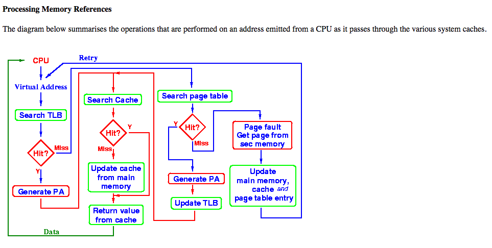

# Operating System review
> Kirksville, MO Sat April 22, 2017

**Thread vs Process**

-Thread: of a same process, shares memory space (heap, data and text segment) Every thread has its own **stack(return values)**

- Process: runs in separate memory space.

### Processing Memory Reference

