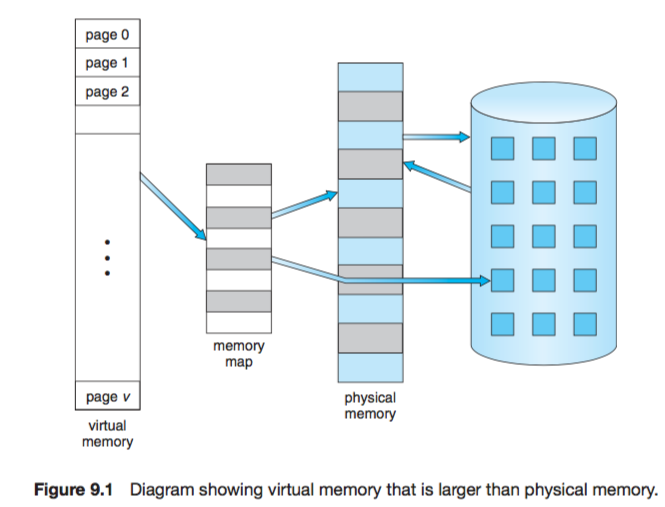
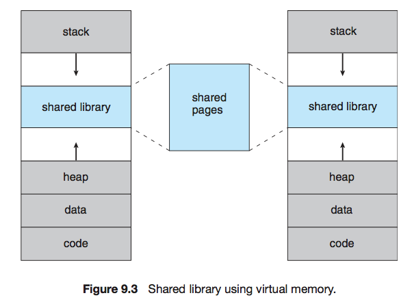
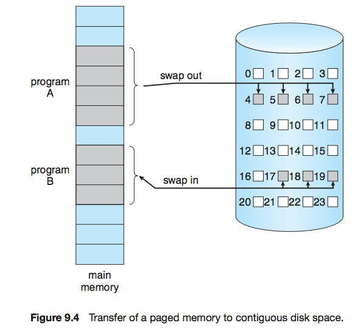
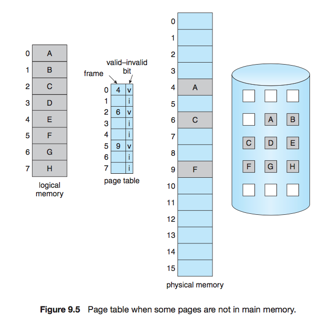

# Virtual memory
> April 12, 2017

### swapper vs pager (demand paging)
**lazy swapper** never swaps a page into memory unless that page will be needed.
- A swapper manipulates the entire processes, whereas a **pager** is concerned with the individual pages of a process.

**page fault:** occurs when a proc generate an address that falls on a page that is not in memory

**pure demand paging** never bring a page into memory until it is required

The hardware to support demand paging is the same as the hardware for paging and swapping:

• Page table. This table has the ability to mark an entry invalid through a valid–invalid bit or a special value of protection bits.

• Secondary memory. This memory holds those pages that are not present in main memory. The secondary memory is usually a high-speed disk. It is known as the swap device, and the section of disk used for this purpose is known as swap space. Swap-space allocation is discussed in Chapter 10.
